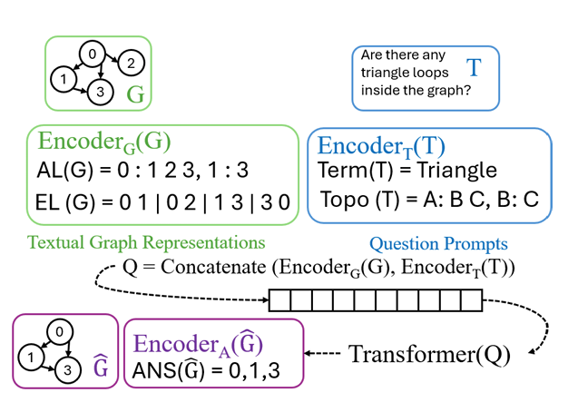
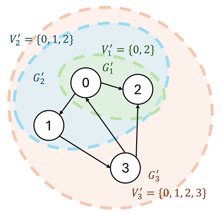
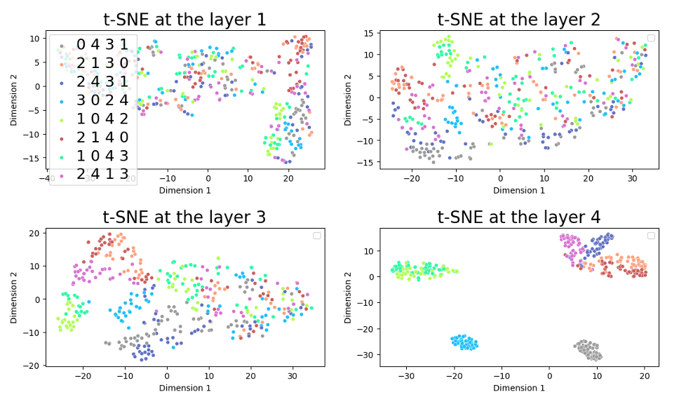
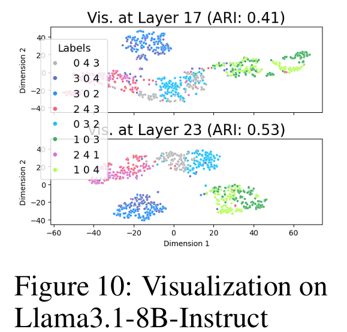
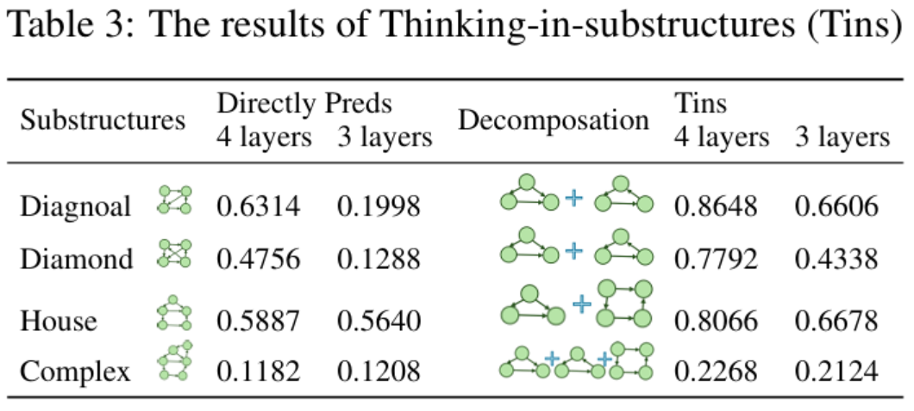
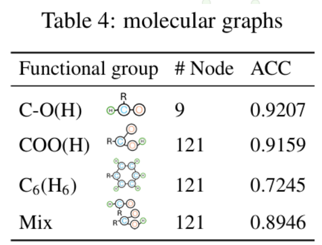
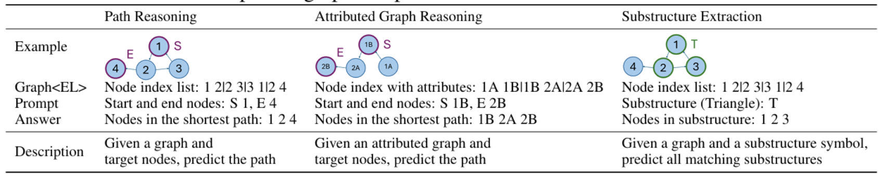
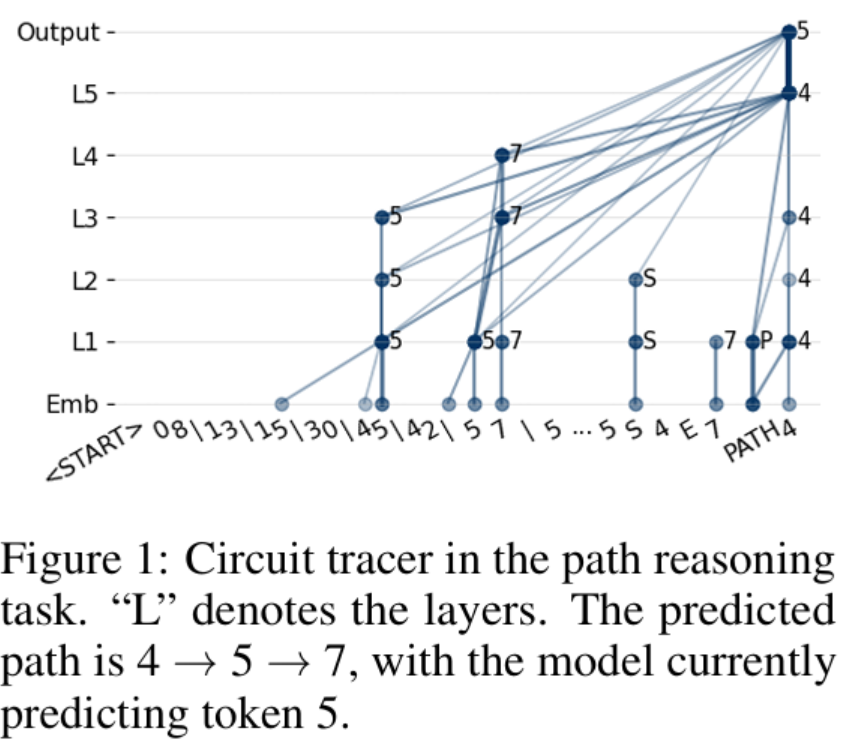
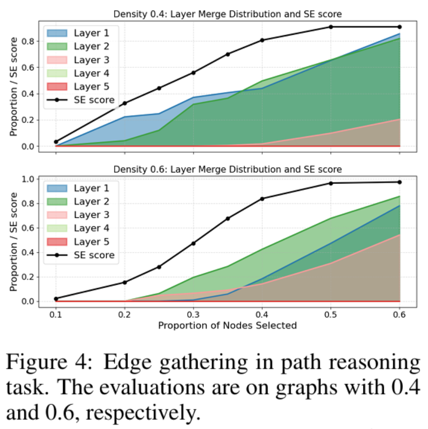
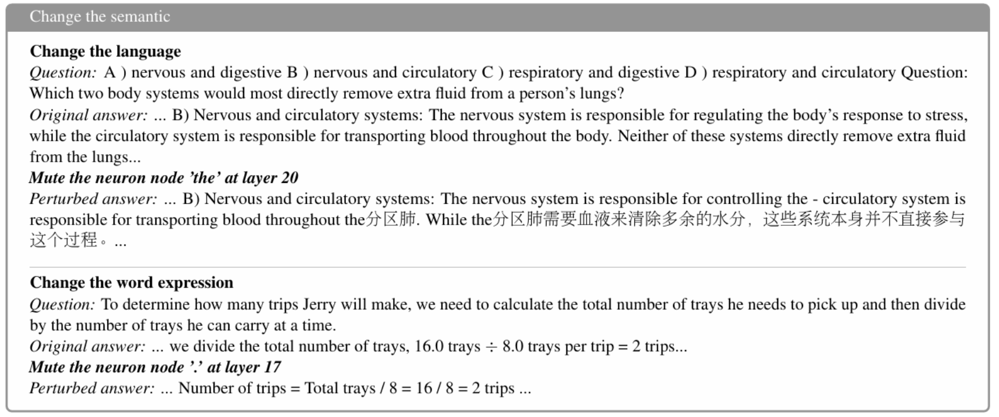

[中文版](https://zhuanlan.zhihu.com/p/1962063445030602451)

<!-- This is a sample blog post. Lorem ipsum I can't remember the rest of lorem ipsum and don't have an internet connection right now. Testing testing testing this blog post. Blog posts are cool. -->

Graph for LLM (1)
======

# 🕊️ Two Papers in discussing graphs on LLMs.

Big thanks to **NeurIPS** for accepting my paper,  
**[From Sequence to Structure: Uncovering Substructure Reasoning in Transformers](https://arxiv.org/abs/2507.10435)** — otherwise, there’d be nothing new to post this season.

Honestly, I didn’t expect it to get in. After the rebuttal, everyone’s scores went up — except mine.  
But I still wanted to go to the conference, so in August I wrote a **workshop paper** for *Efficient Reasoning*,  
**[Uncovering Graph Reasoning in Decoder-only Transformers with Circuit Tracing](https://arxiv.org/abs/2509.20336)**.

Luckily, both were accepted in the end — huge thanks to the ACs! 🙏 

---

## 1. What Are These Papers About?

Both papers explore **how decoder-only Transformers trained from scratch** handle **graph reasoning tasks**.

This question isn’t new. People have debated for years *why* Transformers can perform things like **path reasoning**, such as shortest-path prediction.  
Some argue Transformers memorize edges, others that they “stack” edges during search [[2](https://arxiv.org/pdf/2412.04703)].

Most of these studies use simple tasks to probe structural understanding — showing that LLMs *partially* grasp structure, but not fully.

In our earlier work, though, we found something interesting: when Transformers solve graph tasks, they don’t seem to reason like humans at all.  
So we retrained Transformers from scratch on **pattern understanding** — essentially **structure extraction**.

But “structure extraction” in LLMs isn’t just “does the graph contain this subgraph?” — the model often needs to **generate** the reasoning process or list of nodes.

To simplify analysis, we used **directed graphs**, requiring the model to list all nodes in each target subgraph.  
We also minimized textual noise by designing structured inputs:

- **Encoder_G(G)** → encodes graph topology (neighbor-based or edge-based)  
- **Encoder_T** → describes the target subgraph (by name or pattern schema)  
- **Encoder_A** → encodes the answer (the actual node list)

---

## 2. Can Transformers Solve Subgraph Tasks?

We broke it down systematically:

- Graphs with **one** target substructure → solvable  
- Graphs with **multiple** substructures of **one type** → solvable  
- Graphs with **multiple** substructures of **different types** → still solvable  

Why? Because each Transformer layer behaves like an **Intra-Sample Fusion (ISF)** process — each layer *absorbs* at least one node in parallel, merging multiple subgraph signals simultaneously.

We can even observe this at the **last token’s hidden state** — the aggregated graph representation:

By layer 4, the aggregation of nodes (different colors = different node IDs) becomes clearly visible.

And importantly, we’re looking at the **final representation**, not embeddings of predicted node IDs — meaning the model *already knows the answer* before generation.  
The node tokens are just a way to unpack that hidden structure.

We also tested this on **Llama**, generating triangle subgraphs:

Same story: node aggregation emerges in higher layers.  
So — maybe all that “reasoning” and code generation LLMs do? Could just be a *performance*.  
The model already decided where the subgraph is long before it starts “thinking.”

---

## 3. Decomposing Structures: How Transformers Simplify Complex Graphs

In our previous **GraphPatt** work, we noticed Transformers often *decompose* complex subgraphs —  
e.g., a “house” shape (triangle + square) is solved by first finding all triangles, then connecting them.

We verified this by training Transformers on **decomposed** tasks — efficiency shot up.  
Essentially, Transformers detect multiple shapes *in parallel* across subspaces, and combine them into the final structure.

We also tried simple **chain-of-thought prompting**, but it didn’t help — so maybe *pattern-based chains* are a more efficient alternative.

And yes, we tried molecular graphs too — and surprisingly, it worked even better, since molecule graphs are often sparser.

---

## 4. When Anthropic Dropped the Bomb

Right in the middle of this, **Anthropic** dropped  
**[On the Biology of a Large Language Model](https://transformer-circuits.pub/2025/attribution-graphs/biology.html)** — a masterpiece on **circuit tracing**.

We thought: if they’re talking about *graphs inside LLMs*, how different are those *implicit* graphs from our *explicit* input graphs*?*

Since we’d already studied both **path reasoning** and **pattern extraction**, we needed a unified understanding —  
so we directly applied **circuit tracing to graph inputs**.  
That became our **Efficient Reasoning workshop paper**.

And the results?

**Path reasoning:**

---

## 5. What We Learned

Decoder-only Transformers learn graph structures by **token merging** — they compress related information directly.

- For **path reasoning**, what gets merged are *edges*  
- For **pattern extraction**, it’s *node groups* forming particular shapes  

So edges are basically **2-node patterns**, explaining why **2 layers** are enough for simple path reasoning.

Then why does it feel hard sometimes?  
Because it depends on **graph density** [[3](https://arxiv.org/pdf/2403.06963)].

We found that denser graphs push edge aggregation to *higher layers* —  
meaning layers act like compression units.  
If too many next-token candidates exist (i.e., high density), one layer can’t hold all the information,  
so more layers are needed.  
(Compression ratios → **future work™️**)

---

## 6. Implicit Graphs ≠ Explicit Graphs

We tried to directly align implicit and explicit graph structures — and failed.

So no, Transformer reasoning isn’t human reasoning.  
But the **implicit graph** inside the model is still useful.

We can, for example, run **degree counting** or **PageRank** on it to find influential neurons —  
as in **[GraphGhost](https://arxiv.org/pdf/2510.08613)** [[4](https://arxiv.org/pdf/2510.08613)].

Here’s a fun case study:

After muting high-degree tokens, **Qwen** switched to reasoning *in Chinese*.  

And yes, people are already running **GNNs inside LLMs** [[5](https://arxiv.org/pdf/2510.09312)].

---

## 7. Do We Still Need Graph Research in the LLM Era?

Absolutely.

Graphs are **clean**, **interpretable**, and **minimal** — perfect for testing hypotheses about Transformer mechanisms.

They help us probe ideas like:

- **Superposition**
- **Chains of continuous thought** [[6](https://arxiv.org/pdf/2505.12514)]
- **Reinforcement learning dynamics** [[7](https://arxiv.org/pdf/2509.22613)]
- Viewing reasoning steps as **graph structures** [[8](https://arxiv.org/pdf/2506.05744)]

Although step-wise segmentation isn’t always precise — sometimes specific tokens in higher layers trigger logical shifts —  
graphs still give us the clearest window into those processes.

And if we believe an LLM’s internals resemble a **knowledge graph**,  
then we can design **message-passing mechanisms** to make generation more controllable.

The cycle continues:

> Data → Deep Learning → Knowledge → LLM → Knowledge (again, via RAG… or something next)

---

🕊️ **See you all in San Diego — come find the pigeon poster.**

======

<!-- Aren't headings cool? -->
------